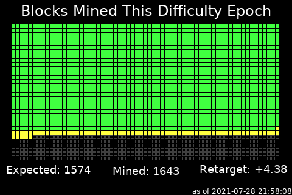
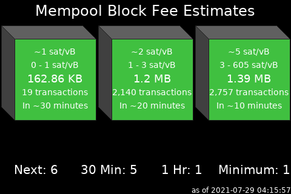
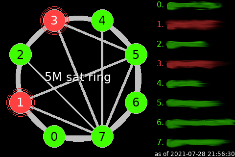
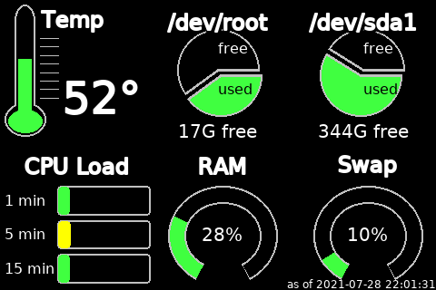
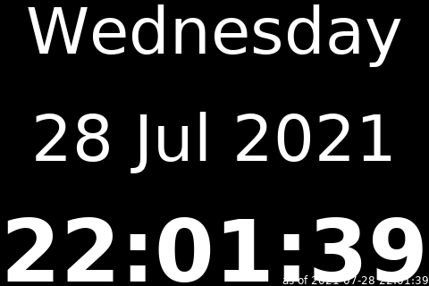

# nodeyez
Display panels to get the most from your node

This repository contains simple [scripts](./scripts) that can be run with Python to generate images representing different state about your node.  It may then be easily displayed to an attached screen.  A simple [slideshow.sh](./scripts/slideshow.sh) script can cycle through the images every few seconds for near live information updates.


- [block height](#blockheightpy)
- [difficulty epoch](#difficultyepochpy)
- [mempool blocks](#mempool-blockspy)
- [ring of fire](#rofstatuspy)
- [sats per usd](#satsperusdpy)
- [system info](#sysinfopy)
- [utc clock](#utcclockpy)


## ToDo / Plans / Known Issues

This repository is in Alpha stage. This means it likely has bugs, and documentation may not fully guide a new user to succesful operation.  Users of this repository are invited to provide feedback, in the form of questions, recommendations, bug reports etc.  

Currently, all the python scripts assume that image files will be generated and saved in a common folder (/home/admin/images). This was done for expedience when developing this prototype on a MyNode instance.  The plan is to improve these scripts to use a single output folder instead of configuring them uniquely, and to turn this all into a more easily managed service. Eventually, it could become a package/application for the popular node deployments

The [slideshow](./scripts/slideshow.sh) viewer uses the framebuffer imageviewer, which requires root access. I believe this could be gotten around by adding whatever user would be running it to the `video` group.  

## Pre-requisites

1. Build yourself a Raspberry Pi Bitcoin Node.  
Consider following the helpful guidance at [node.guide](https://node.guide) on different nodes available.  Personally I like [Stadicus Raspibolt](https://github.com/Stadicus/RaspiBolt) and [MyNodeBTC](https://github.com/mynodebtc/mynode), but nearly any Raspberry Pi based node should be sufficient provided you have access to the GPIO pins.

2. Acquire and install a 3.5" TFT screen
The resolution is 480x320 and should be based on the XPT2046 chip.  The one I've used I got from a local electronics store.

3. Enable the GPIO for SPI. 
Login to your pi, and do `sudo raspi-config` (menu 3 Interface Options / P4 SPI). Save and exit.

4. Edit /boot/config.txt
```sh
sudo nano /boot/config.txt
```
You'll want to verify that it has `dtparam=spi=on`
Add a line at the bottom to set `dtoverlay=piscreen,speed=16000000,rotate=270`
The rotation should be 0, 90, 180, or 270 based on how you've oriented your screen. For reference, I have mine hanging on a wall with the USB and ethernet port to the right.

5. Install framebuffer image viewer
This is pretty straightforward. Just do 
```sh
sudo apt-get install fbi
```

6. Install Python
Raspberry Pi should come with Python 2.7 but will assume using Python3 in this guide. Go ahead and install with the following
```sh
sudo apt-get install python3
```

7. Install the Python Pillow library
These scripts were created with the newer Pillow library, but may work with PIL as well. Its my understanding that you can't install both. So its worth doing a check before installing.  See if pil or pillow is installed
`pip list | grep --ignore-case pi`
sample output
```sh
googleapis-common-protos 1.52.0
Pillow                   8.3.1
pip                      21.2.1
pipenv                   2020.6.2
RPi.GPIO                 0.7.0
typing-extensions        3.7.4.2
```
If neither PIL or Pillow is installed, then go ahead with
`pip install Pillow`

8. Reboot
You'll need to reboot before the changes for boot and the GPIO pins are enabled for the screen.  Do a safe shutdown. If you're running a node package like MyNodeBTC, then use the console to power cycle the device cleanly.  

9. Create a folder for all the images
The scripts assume `/home/admin/images` but you could use a different user account, provided they have access to the same resources.  Most scripts will reference bitcoin-cli and ln-cli.

10. Clone the repository
```sh
sudo apt install git
git clone https://github.com/vicariousdrama/nodeyez.git
```

## blockheight.py
This python script will query the local bitcoin node using bitcoin-cli and prepare an image representing the block height


Before running the script, edit it to make changes
```
nano scripts/blockheight.py
```
You may want to change the location of the outputFile.
If you want to adjust the frequency, alter the sleeptime parameter near the bottom of the script (default 2 minutes).
Save (CTRL+O) and Exit (CTRL+X).

Run it as a background process
```
python3 scripts/blockheight.py &
```
The process id will be reported to the display

If you need to see if its running
```
ps aux | grep blockheight
```

## difficultyepoch.py
This python script will query the local bitcoin node using bitcoin-cli and prepare an image representing the number of blocks that have been mined thus far in this difficulty epoch, and indicate if ahead of schedule or behind, with an estimated difficulty adjustment to occur when the next epoch begins.  A difficulty epoch consists of 2016 blocks.



Before running the script, edit it to make changes
```
nano scripts/difficultyepoch.py
```
You may want to change the location of the outputFile.  You can also alter the colors of mined and expected blocks, etc if you so desire.
If you want to adjust the frequency, alter the sleeptime parameter near the bottom of the script (default 10 minutes).
Save (CTRL+O) and Exit (CTRL+X).

Run it as a background process
```
python3 scripts/difficultyepoch.py &
```

## mempool-blocks.py
This python script will query the mempool.space service. By default it assumes the usage of mempool space viewer on a local MyNodeBTC instance, but the script can be altered to use the public [mempool.space](https://mempool.space) website.  It will display up to 3 upcoming blocks in a similar way as mempool space website renders.



Before running the script, edit it to make changes
```
nano scripts/mempool-blocks.py
```
You may want to change the location of the outputFile.  
If you have mempool viewer running locally, but a different location/port, then update urlmempool and urlfeerecs.
If you dont have mempool viewer running locally, you can use the mempool.space website by commenting the existing values, and uncommenting the ones for mempool.space
If you want to adjust the frequency, alter the sleeptime parameter near the bottom of the script (default 5 minutes).
Save (CTRL+O) and Exit (CTRL+X).

Run it as a background process
```
python3 scripts/mempool-blocks.py &
```

## rofstatus.py
The Ring of Fire python script provides renderings of configured Lightning Ring of Fire groups.  If you have a lightning node and participate in a Ring of Fire, you can configure the pubkeys for each node in the preordained sequence and the script will provide a useful image showing its present state.  If channels dont exist on the ring between nodes, then an X will be displayed.  Offline nodes are colored red (or whatever configurable color per rofstatus.json) and have rings around them to draw attention.  Node operator contact list appears to the right of the ring.  You can define as many ring of fire configurations as you want in the rofstatus.json, and each can have unique colors, labels, and fonts.



Before running the script, you should review it
```
nano scripts/rofstatus.py
```
This script relies on lncli, and gets its configuration from `rofstatus.json`.  When done reviewing, exit the file (CTRL+X)

Now edit the rofstatus.json
```
nano scripts/rofstatus.json
```
You can adjust the frequency (default 900 seconds/15 minutes) if desired, but 15 minutes is actually quite aggressive. In general, no major changes to ring status should be transpiring this often, and its more helpful when diagnosing member outages.
For each ring you are a member of, or what to monitor, collect the public keys for the nodes, the order they appear in, and some means to refer to the operator for convenience (twitter handles or emails are fine).
In the `rings` array, an object has fields for `name`, `imagefilename`, `imagesettings`, and `nodes`.  The name is what appears as text in the middle of the ring when the graphic is created. The imagefilename is where to save the file to.  Each ring defined in the configuration file should get its own filename as it is overwritten each time.  The imagesettings allow fine tuning the colors, fonts and text sies.  With the public keys for nodes and operator information, provide a node object in the nested array.
Save (CTRL+O) and Exit (CTRL+X).

Run it as a background process
```
(
cd scripts 
python3 rofstatus.py &
)
```

## satsperusd.py
This python script calls upon the bisq marketplace to get the current fiat valuation of Bitcoin in US Dollar terms, and then calculates the sats per dollar and displays graphically


Before running the script, edit it to make changes
```
nano scripts/satsperusd.py
```
You may want to change the location of the outputFile.  You can also alter the colors representing each sat if you so desire.
If you want to adjust the frequency, alter the sleeptime parameter near the bottom of the script (default 1 hour). This calls out to the bisq marketplace data, so an hour is likely sufficient.  It does report the low and high for the past day which gives you a nice range of current valuation.
Save (CTRL+O) and Exit (CTRL+X).

Run it as a background process
```
python3 scripts/satsperusd.py &
```

## sysinfo.py
A useful python script that reports the CPU temperature and load, drive space in use and free, as well as memory usage.  Color coding follows green/yellow/red for ranging from all OK to heavy usage to warning.



Before running the script, edit it to make changes
```
nano scripts/sysinfo.py
```
You may want to change the location of the outputFile.  
This script assumes you have a microsd card as the boot drive, and an external drive, like an SSD attached for the main drive.
If your configuration is different you may need to adjust the drive devices referenced on 109,118 and 206,207
If you want to adjust the frequency, alter the sleeptime parameter near the bottom of the script (default 30 seconds).
Save (CTRL+O) and Exit (CTRL+X).

Run it as a background process
```
python3 scripts/sysinfo.py &
```

## utcclock.py
This script provides a simple rendering of the current date and time



Before running the script, edit it to make changes
```
nano scripts/utcclock.py
```
You may want to change the location of the outputFile.
Save (CTRL+O) and Exit (CTRL+X).

Run it as a background process
```
python3 scripts/utcclock.py &
```

## Running the Slideshow

Once you've started processes to create desired image panels from above, now its time to display them on your screen.

The [slideshow.sh](./scripts/slideshow.sh) file is a basic wrapper around the fbi program.  To run it

```
(
cd scripts
chmod +x slideshow.sh
sudo ./slideshow.sh &
)
```

You should start seeing images display on your screen.  If you dont see any images, then edit the slideshow.sh file, and remove the part at the end `> /dev/null 2>&1` and rerun. Any errors should be reported to help diagnose.
