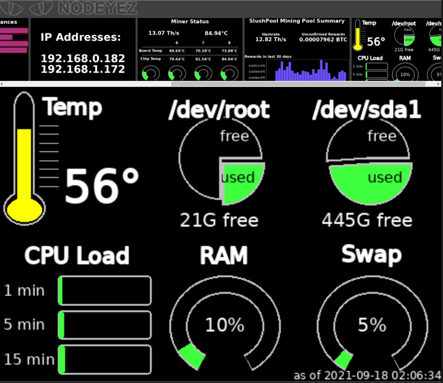

# 
Display panels to get the most from your node

[Home](../README.md) | [Back to Nodeyez User](./install-4-nodeyez.md) | [Continue to Running Services at Startup](./install-6-runatstartup.md)

---

## Setting up the Website Dashboard

Whether you are using a display screen or not, you can also make the images 
viewable via website dashboard.  The dashboard included in nodeyez looks like
this



The dashboard view will automatically cycle through the same images at 10 second
intervals, showing smaller versions at the top of the screen.  

Clicking on an image will automatically advance the view to the full size 
version of that one.

There are multiple options for setting up the dashboard.  Choose the most
appropriate based on your raspberry pi node

Before beginning, make sure you are logged in as the privileged user.  If you
continued here from the previous section logged in as `nodeyez`, then issue
the following to return back to the privileged user

   ```sh
   exit
   ```

## Choose ONE (1) of the following

- [Install for MyNodeBTC](#install-for-mynodebtc)
- [New Install of NGINX](#new-install-of-nginx)
- [Modifying Existing NGINX Setup](#modifying-existing-nginx-setup)

## Install for MyNodeBTC

If you are using [MyNodeBTC](https://mynodebtc.com/), then you should follow 
this section.  MyNodeBTC already comes with NGINX and will update over top of 
configuration files. Thankfully, it also makes use of the sites-enabled and 
[reverse-proxy](https://docs.nginx.com/nginx/admin-guide/web-server/reverse-proxy/) 
features to make this a little easier.

* Copy necessary files for NGINX

We want to enable the XSLT module, create a definition for the Nodeyez 
dashboard on port 907, and our template that generates the dashboard view.

   ```sh
   sudo cp /home/nodeyez/nodeyez/scripts/nginx/a_xslt.conf /etc/nginx/modules-enabled/a_xslt.conf
   sudo cp /home/nodeyez/nodeyez/scripts/nginx/https_nodeyez.conf /etc/nginx/sites-enabled/https_nodeyez.conf
   sudo cp /home/nodeyez/nodeyez/scripts/nginx/imagegallery.xslt /etc/nginx/imagegallery.xslt
   sudo chown root:root /etc/nginx/modules-enabled/a_xslt.conf
   sudo chown root:root /etc/nginx/sites-enabled/https_nodeyez.conf
   sudo chown root:root /etc/nginx/imagegallery.xslt
   ```

* Test the NGINX configuration and restart the service.

There should be no errors when running the test with the first command.

   ```sh
   sudo nginx -t
   sudo systemctl restart nginx
   ```
  
* Enable Access Through Firewall

   ```sh
   sudo ufw allow 907 comment 'allow access to nodeyez images over ssl'
   ```
 
Now see if you can access the dashboard at https://your-node-ip:907

[Continue to Running Services at Startup](./install-6-runatstartup.md)


## New Install of NGINX

   ```sh
   sudo apt install -y nginx
   ```

* Create a self-signed TLS certificate (valid for 10 years)

   ```sh
   sudo openssl req -x509 -nodes -newkey rsa:2048 -keyout /etc/ssl/private/nginx-selfsigned.key -out /etc/ssl/certs/nginx-selfsigned.crt -subj "/CN=localhost" -days 3650
   ```

* To completely disable the NGINX webserver and configure the TCP reverse proxy
  for displaying the images, remove the default configuration and use the 
  premade nginx.conf file.

   ```sh
   sudo mv /etc/nginx/nginx.conf /etc/nginx/nginx.conf.bak
   sudo cp /home/nodeyez/nodeyez/scripts/nginx/nginx.conf /etc/nginx/nginx.conf
   sudo cp /home/nodeyez/nodeyez/scripts/nginx/imagegallery.xslt /etc/nginx/imagegallery.xslt
   sudo chown root:root /etc/nginx/nginx.conf
   sudo chown root:root /etc/nginx/imagegallery.xslt
   ```

* Test the NGINX configuration and restart the service.

   ```sh
   sudo nginx -t
   sudo systemctl restart nginx
   ```

* Enable Access Through Firewall

   ```sh
   sudo ufw allow 907 comment 'allow access to nodeyez images over ssl'
   ```
 
Now see if you can access the dashboard at https://your-node-ip:907

[Continue to Running Services at Startup](./install-6-runatstartup.md)

## Modifying Existing NGINX setup

If you already have nginx installed, then you really just need to add a local 
server listening on a port, and an upstream node for optional SSL proxying.  
Node that this is a very crude way of piggybacking the install.

The premade configuration used in the prior section uses ports 906 for http, and
907 for SSL.  Why port 907? No reason other then its placement in the 
[BIP39 wordlist](https://github.com/bitcoin/bips/blob/master/bip-0039/english.txt#L907).

* Copy in the stylesheet and set ownership

   ```sh
   sudo cp /home/nodeyez/nodeyez/scripts/nginx/imagegallery.xslt /etc/nginx/imagegallery.xslt
   sudo chown root:root /etc/nginx/imagegallery.xslt
   ```

* Edit the NGINX configuration file

   ```sh
   sudo nano /etc/nginx/nginx.conf
   ```
  
* Add an upstream definition inside the stream block

   ```nginx
   upstream nodeyez {
      server 127.0.0.1:906;
   }
   ```

* Add a server definition to listen as ssl

   ```nginx
   server {
      listen 907 ssl;
      proxy_pass nodeyez;
   }
   ```
  
* At the bottom of the file, create an entirely new http block

   ```nginx
   http {
     include mime.types;
     server {
       listen 906;
       root /home/nodeyez/nodeyez/imageoutput;
       default_type text/html;
       location / {
         autoindex on;
         autoindex_format xml;
         xslt_string_param title $1;
         xslt_stylesheet /etc/nginx/imagegallery.xslt;
         try_files $uri $uri/ =404;
       }
     }
   }
   ```
  
* Save (CTRL+O) and exit (CTRL+X) the file

* Test the NGINX configuration and restart the service.

   ```sh
   sudo nginx -t
   sudo systemctl restart nginx
   ```

* Enable Access Through Firewall

   ```sh
   sudo ufw allow 907 comment 'allow access to nodeyez images over ssl'
   ```
 
Now see if you can access the dashboard at https://your-node-ip:907

[Continue to Running Services at Startup](./install-6-runatstartup.md)

---

[Home](../README.md) | [Back to Nodeyez User](./install-4-nodeyez.md) | [Continue to Running Services at Startup](./install-6-runatstartup.md)

