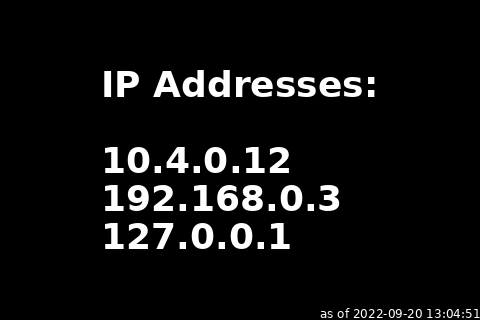

# 
Display panels to get the most from your node

## IP Address

This script prepares an image enumerating the IP Addresses of the raspberry pi
limited to IPv4 addresses.  The script is installed at
[/home/nodeyez/nodeyez/scripts/ipaddress.py](../scripts/ipaddress.py).
This can be useful if you setup your raspberry pi to get an IP address 
dynamically via DHCP on the local network, but don't assign it a reserved
address at the DHCP server/router.  It can also be helpful to see what IP
addresses are bound as listeners for local virtual networks typically setup
with Docker.



* To run this script

   ```sh
   cd /home/nodeyez/nodeyez/scripts
   /home/nodeyez/nodeyez/scripts/ipaddress.py
   ```

   Press CTRL+C to stop the process

* To configure this script

   Override the default configuration as follows

   ```sh
   nano /home/nodeyez/nodeyez/config/ipaddress.json
   ```

   | field name | description |
   | --- | --- |
   | outputFile | The path to save the generated image. Default `/home/nodeyez/nodeyez/imageoutput/ipaddress.png` |
   | colorTextFG | The color of the text expressed as a hexadecimal color specifier. Default `#ffffff` | 
   | colorBackground | The background color of the image expressed as a hexadecimal color specifier. Default `#000000` |
   | width | The width, in pixels, to generate the image. Default `480` |
   | height | The height, in pixels, to generate the image. Default `320` |
   | sleepInterval | The amount of time, in seconds, the script should wait before data gathering and image creation again. Default `120` |

   After making changes, Save (CTRL+O) and Exit (CTRL+X) nano.


---

[Home](../README.md) | 

